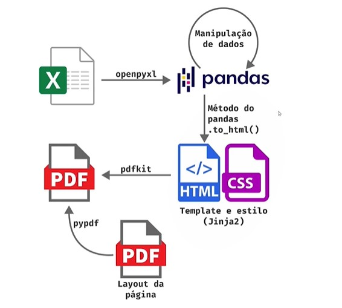

# Gerando Relatórios PDF via Excel

Neste projeto, foi criado uma automação, desde o processamento inicial dos dados até a formatação final e geração do PDF. O processo foi gerado com a biblioteca pandas, realizada a exploração de como transformar esses dados em tabelas HTML atraentes utilizando templates de Jinja e estilização CSS, e a transformação do HTML em PDF na combiná-lo com layouts customizados.

### Fluxo:

Começamos com a planilha de Excel, utilizando a biblioteca openpyxl para ler a planilha para dentro do pandas. Após manipular os dados com pandas transformamos essa tabela em HTML - esse HTML está dentro de um template e arquivo de estilização css -  utilizando a biblioteca Jinja2. A partir dai utilizamos outro pacote pdfkit que vai gerar um arquivo estilizado e por fim a bilbioteca pypdf para finalizar o layout ja pronto.

